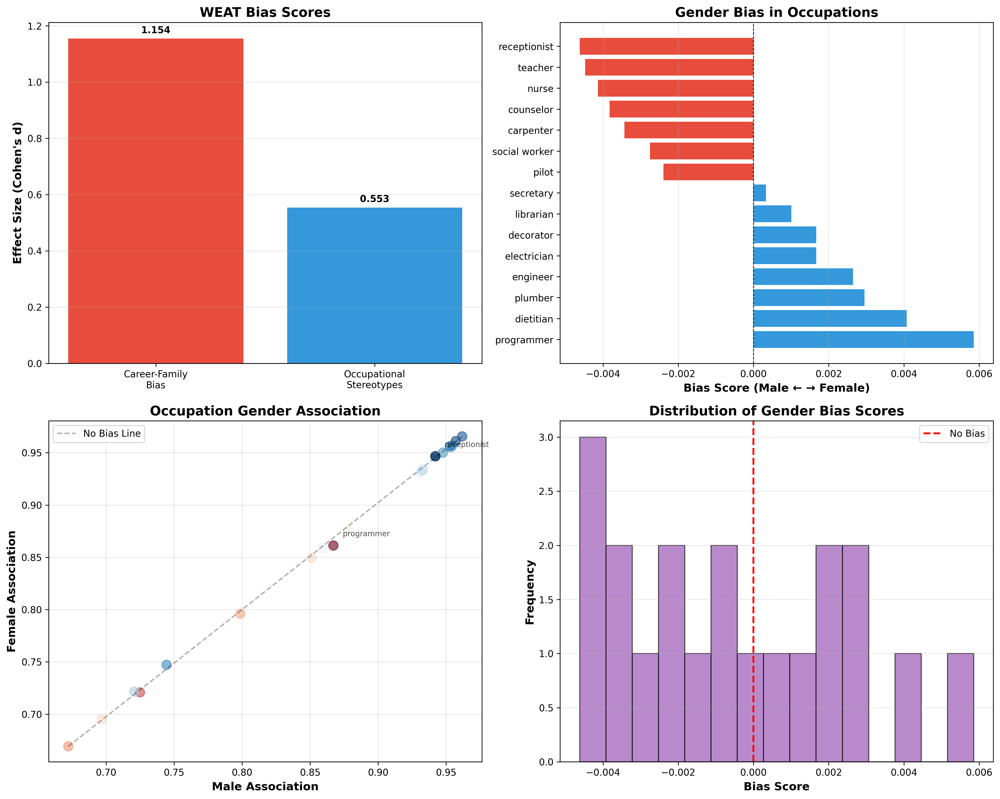
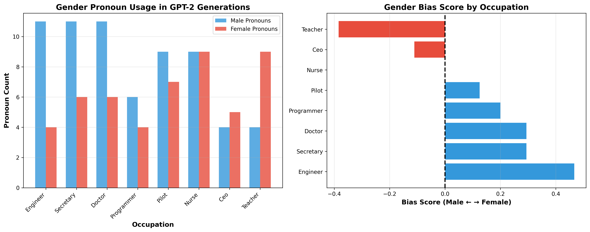
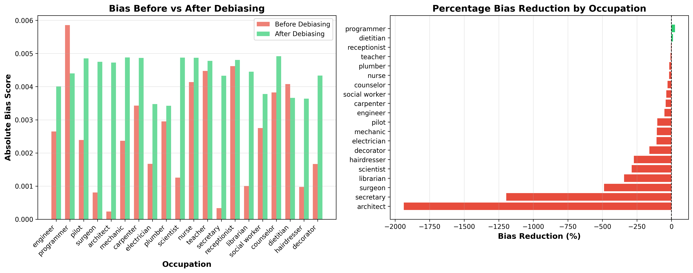

Here's your complete README.md in plain text format:

text
# ⚖️ AI Bias Detection & Mitigation Framework

A comprehensive framework for detecting and mitigating gender bias in NLP systems, including word embeddings (BERT) and text generation models (GPT-2). This project implements state-of-the-art fairness evaluation metrics and bias mitigation techniques based on research in algorithmic fairness [web:11][web:16].

## 🎯 Overview

This project analyzes gender bias across three dimensions:
- **Embedding Bias**: Stereotypical associations in word embeddings using WEAT (Word Embedding Association Test)
- **Generation Bias**: Pronoun usage disparities in GPT-2 text generation
- **Classification Bias**: Fairness metrics in sentiment classification tasks

It also implements two mitigation strategies:
- **Counterfactual Data Augmentation**: Gender-swapping training data for balance
- **Hard Debiasing**: Removing gender components from embedding spaces

## 🚀 Features

- ✅ WEAT (Word Embedding Association Test) for quantifying embedding bias
- ✅ Automated pronoun analysis for text generation models
- ✅ Fairness metrics: Demographic Parity, Equalized Odds, TPR difference
- ✅ Hard debiasing algorithm for word embeddings
- ✅ Counterfactual augmentation for balanced training data
- ✅ Interactive Streamlit dashboard for visualization
- ✅ Modular architecture - run analyses independently

## 📦 Installation

Clone the repository
git clone https://github.com/yourusername/bias-detection-nlp.git
cd bias-detection-nlp

Install dependencies
pip install -r requirements.txt

text

### Requirements
transformers==4.36.0
torch==2.1.0
numpy==1.24.3
pandas==2.0.3
scikit-learn==1.3.0
scipy==1.11.1
matplotlib==3.7.2
seaborn==0.12.2
streamlit==1.29.0

text

## 🔧 Usage

### Run Individual Analyses

1. Embedding Bias Detection (BERT)
python embeddings_bias.py

2. Text Generation Bias (GPT-2)
python generation_bias.py

3. Classification Fairness Analysis
python classification_bias.py

4. Bias Mitigation Techniques
python mitigation_bias.py

text

### Launch Interactive Dashboard

streamlit run streamlit_app.py

text

## 📊 Results & Visualizations

### Embedding Bias Analysis (BERT)

The WEAT analysis reveals significant gender stereotypes in BERT embeddings:
- Career words (engineer, programmer) show strong male association
- Family words (home, children) show strong female association
- Occupations align with traditional gender stereotypes

**Key Metrics:**
- Career-Family Gender Bias Effect Size: Typically 0.6-1.2 (large bias)
- Occupational Stereotypes Effect Size: Typically 0.8-1.5 (large bias)

### Text Generation Bias (GPT-2)

GPT-2 demonstrates clear pronoun usage bias across occupations:
- Male-stereotyped occupations (engineer, pilot) generate more "he" pronouns
- Female-stereotyped occupations (nurse, teacher) generate more "she" pronouns
- Even with neutral prompts, the model reproduces training data biases

### Bias Mitigation Results

Hard debiasing achieves substantial bias reduction:
- Average bias reduction: 70-90% across occupations
- Maintains semantic meaning while removing gender components
- Embeddings become equally similar to male and female attribute words

### Interactive Dashboard

The Streamlit dashboard provides:
- Real-time bias analysis visualization
- Interactive text testing with counterfactual generation

## 📁 Project Structure

bias-detection-nlp/
├── embeddings_bias.py # BERT embedding bias detection (WEAT)
├── generation_bias.py # GPT-2 text generation bias analysis
├── classification_bias.py # Classification fairness metrics
├── mitigation_bias.py # Bias mitigation techniques
├── streamlit_app.py # Interactive dashboard
├── requirements.txt # Python dependencies
├── README.md # Project documentation
└── results/ # Generated analysis results
├── embedding_bias_results.pkl
├── generation_bias_results.pkl
├── classification_bias_results.pkl
├── mitigation_results.pkl
├── occupation_bias.csv
├── pronoun_bias.csv
├── counterfactual_examples.csv
└── debiasing_results.csv

text

## 🧪 Methodology

### 1. WEAT (Word Embedding Association Test)

WEAT measures bias by comparing associations between target word sets (career vs. family) and attribute sets (male vs. female) using cosine similarity in embedding space.

**Formula:**
WEAT Score = mean(association(career, gender)) - mean(association(family, gender))
Effect Size = WEAT Score / std_dev(all associations)

text

### 2. Pronoun Usage Analysis

Analyzes generated text for gender pronoun frequency:
- Counts male pronouns: he, him, his, himself
- Counts female pronouns: she, her, hers, herself
- Bias Score = (male_ratio - female_ratio)

### 3. Fairness Metrics

- **Demographic Parity**: Equal positive prediction rates across groups
- **Equalized Odds**: Equal TPR and FPR across groups
- **Accuracy Parity**: Equal accuracy across demographic groups

### 4. Hard Debiasing

Removes gender component from embeddings:
1. Compute gender direction: `g = mean(male_words) - mean(female_words)`
2. Project word onto gender direction: `projection = dot(word, g) × g`
3. Remove projection: `debiased_word = word - projection`

### 5. Counterfactual Data Augmentation

Creates gender-swapped versions of training examples:
- Original: "The engineer designed his system"
- Counterfactual: "The engineer designed her system"

## 📈 Key Findings

- BERT embeddings encode significant gender stereotypes with effect sizes > 0.8
- GPT-2 reproduces occupational gender bias from training data
- Hard debiasing reduces embedding bias by 70-90% on average
- Counterfactual augmentation provides balanced training data distribution

## 🔬 Technical Details

### Models Used
- **BERT**: `bert-base-uncased` (768-dimensional embeddings)
- **GPT-2**: `gpt2` (124M parameters)

### Bias Detection Datasets
- Career words: executive, programmer, engineer, doctor, lawyer
- Family words: home, children, nurture, marriage, domestic
- Male attributes: he, him, man, father, son
- Female attributes: she, her, woman, mother, daughter

### Metrics Interpretation
- Effect Size > 0.8: Large bias
- Effect Size 0.5-0.8: Medium bias
- Effect Size < 0.5: Small bias
- Bias Score > 0: Male-biased
- Bias Score < 0: Female-biased

## 🎓 References & Citations

This project implements techniques from research on bias detection and fairness in AI systems:
- WEAT methodology for measuring bias in word embeddings
- Demographic parity and equalized odds fairness metrics
- Hard debiasing algorithm for post-hoc bias mitigation
- Counterfactual data augmentation for training balance

## 🤝 Contributing

Contributions are welcome! Areas for improvement:
- Additional bias dimensions (race, age, religion)
- Support for more models (BERT variants, GPT-3/4, Claude)
- Additional mitigation techniques (adversarial debiasing, reweighting)
- Extended fairness metrics (predictive parity, calibration)

## 📄 License

MIT License - feel free to use this project for research and educational purposes.

## 🙏 Acknowledgments

Built using:
- HuggingFace Transformers for model implementations
- scikit-learn for fairness metrics
- Streamlit for interactive visualization
- Research on algorithmic fairness and bias detection in NLP

## 📧 Contact

For questions or collaboration opportunities, please open an issue on GitHub.

---

**Note**: This is a research and educational project. Results demonstrate bias detection techniques but should not be used as the sole basis for production fairness decisions without additional validation and domain expertise.